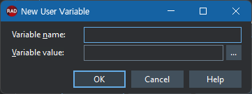
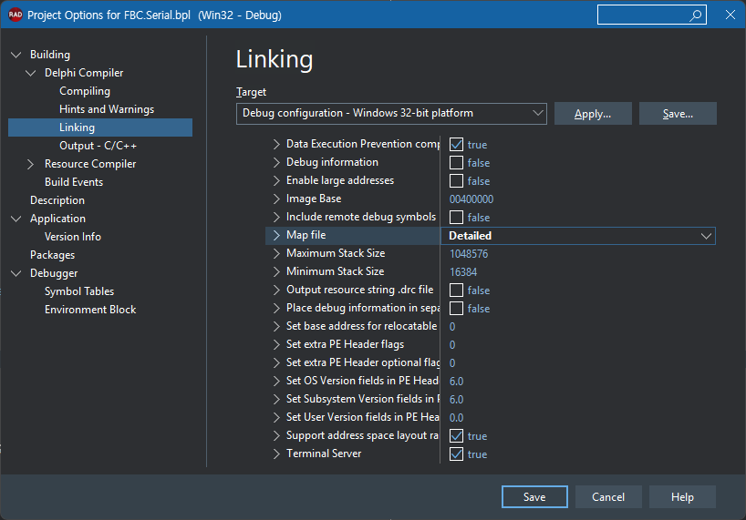

# 환경변수를 활용한 패키지 관리

## 패키지란?

### **델파이 패키지의 개념**
델파이 패키지는 관련된 유닛들을 논리적으로 그룹화하여 재사용 가능한 모듈로 만드는 메커니즘입니다. 패키지는 두 가지 주요 형태로 존재합니다:

**런타임 패키지**

- 실행 시간에 동적으로 로드되는 라이브러리
- 메모리 사용량 최적화 및 코드 공유 가능
- 여러 애플리케이션이 동일한 패키지를 공유할 수 있음

**디자인타임 패키지**

- IDE에서 컴포넌트나 디자인타임 기능을 제공
- 컴포넌트 팔레트에 새로운 컴포넌트 추가 시 사용

### **패키지의 주요 특징**

**모듈화와 재사용성**

- 코드의 논리적 분리와 체계적인 관리
- 다른 프로젝트에서 쉽게 재사용 가능
- 라이브러리 형태로 배포 가능

**메모리 효율성**

- 런타임 패키지 사용 시 여러 애플리케이션이 메모리상의 동일한 코드를 공유
- 전체 시스템의 메모리 사용량 감소

### **패키지 구조**

**패키지 소스 파일 (.dpk)**

```pascal
package MyPackage;

requires
  rtl,
  vcl;

contains
  Unit1,
  Unit2,
  Unit3;

end.
```

**주요 섹션**

- **`requires`**: 의존하는 다른 패키지 목록
- **`contains`**: 패키지에 포함될 유닛 목록

## 환경변수

### **개발 환경의 유연성**

**다양한 개발 환경 지원**

- 개발자마다 다른 폴더 구조나 드라이브를 사용할 때
- 소스 코드의 절대 경로 의존성을 제거

### **배포와 설치의 편의성**

**설치 경로의 동적 결정**

- 프로그램이 다양한 위치에 설치되어도 정상 작동
- 레지스트리 대신 환경변수로 경로 정보 관리

**외부 도구 연동**

- 컴파일러, 라이브러리 경로 자동 감지
- 써드파티 도구들과의 연동 시 경로 설정

## 사용자 정의 환경변수를 활용한 패키지 관리

`Tools` -> `Options` 를 선택한 후 `Environment Variables`를 선택한다


### **시스템 환경변수**


**PATH**: IDE에서 실행되는 프로세스용 경로 확장
**`D:\Works\LIB\BPL\Win32\Debug;$(PATH)`** 로 지정한다. Path에는 상대경로를 적을 수 없으므로 반드시 물리적인 실제 경로를 적어주어야 한다.

### **사용자 지정 환경변수**

프로젝트 관리를 위해 환경변수를 설정한다

`New` 버튼을 눌러 환경변수를 입력한다



| 변수 명          | 변수 값               | 참고                                       |
| ---------------- | --------------------- | ------------------------------------------ |
| $(FBC_BASE)      | D:\Works              | 루트 경로                                  |
| $(FBC_LIB)       | $(FBC_BASE)\LIB       | 라이브러리 경로                            |
| $(FBC_DCU)       | $(FBC_LIB)\DCU        | 컴파일된 유닛(*.dcu, *.dcp) 가 생성될 경로 |
| $(FBC_BPL)       | $(FBC_LIB)\BPL        | 패키지 라이브러리가 생성될 경로            |
| $(FBC_COMPONENT) | $(FBC_BASE)\COMPONENT | Browsing Path에 등록하기 위한 경로         |

### **Library 설정하기**

`Language` -> `Delphi` -> `Library` 를 선택한다


**Library path***

빌드시 사용할 플랫폼 별로 다음과 같이 등록한다

선택가능한 모든 플랫폼별로 모두 등록한다


`$(FBC_DCU)\$(Platform)\$(Config)` 를 등록한다.

**Browsing Path**

IDE에서 소스코드를 편집할 때 `Ctrl+Click` 를 눌러 클래스의 선언부를 찾아가거나 `uses` 목록에서 `Ctrl+Enter` 를 눌러 해당 유닛을 열고자 할 때 디렉토리 정보를 추가해준다.


사용하는 컴포넌트의 수만큼 해당 소스코드의 위치를 등록한다.

`$(FBC_COMPONENT)\패키지명\Source`

## 패키지

### 패키지 이름 부여하기

- `접두어` 는 보통 회사의 약어를 사용한다
- `패키지명` 실제 패키지의 이름을 사용한다
- `디자인타임 여부` 디자인 타임인 경우에만 Design을 붙인다.

이 원칙을 사용해 런타임과 디자인타임 패키지의 이름을 부여하면 다음과 같다.

- 런타임 패키지
  FBC.ComPort
- 디자인타임 패키지
  FBC.ComPort.Design

### 패키지 옵션

**경로 옵션**


- `DCP output directory`
  DCP(Delphi Compiled Package) 파일이 생성될 경로
- `Package output directory`
  BPL(Borland Package Library) 파일이 생성될 경로
- `Unit output directory`
  DCU(Delphi Compiled Unit) 파일이 생성될 경로

**컴파일 옵션***


|                   | Debug             | Release              |
| ----------------- | ----------------- | -------------------- |
| Optimization      | False             | True                 |
| Debug Information | Debug information | No Debug information |
| Use debug .dcu    | True              | False                |

**Linking 옵션**


|                   | Debug | Release  |
| ----------------- | ----- | -------- |
| Debug Information | True  | False    |
| Map file          | Off   | Detailed |
| Use debug .dcu    | True  | False    |

**Output - C/C++**


|                              | 델파이 전용        | C++Builder 지원         |
| ---------------------------- | ------------------ | ----------------------- |
| C/C++ Output file Generation | Generate DCUs only | Generate all C++Builder |

**Description**


- Description
  디자인타임 패키지에만 작성하면, 패키지에 대한 간략한 설명을 적는다
- LIB prefix
  패키지의 접두어 (권장하지 않음)
- LIB suffix
  패키지의 접미어 (권장하지 않음)
- LIB version
  라이브러리 버전 (권장하지 않음)
- Usage Options
  - 런타임 패키지
    Runtime Only
    Explict rebuild
  - 디자인타임 패키지
    DesignTime only
    Explict rebuild

### 실제 패키지 빌드해보기

시리얼포트 컴포넌트인 TComPort 의 패키지를 빌드해본다

**폴더 구성**

```console
D:\Works\
  ├── COMPONENT                 컴포넌트 소스 폴더
  │   └── CPort
  │       ├── Design            디자인타임 패키지에서 사용하는 소스 유닛
  │       ├── Packages          패키지 프로젝트 파일
  │       └── Source            런타임 패키지에서 사용하는 소스 유닛
  ├── DLL
  │   ├── Win32                 Win32용 DLL
  │   └── Win64                 Win64용 DLL
  ├── LIB
  │   ├── BPL                   BPL 파일이 생성되는 경로
  │   │   ├── Win32             
  │   │   │   ├── Debug
  │   │   │   └── Release
  │   │   └── Win64
  │   │       ├── Debug
  │   │       └── Release
  │   └── DCU                   DCO, DCU 파일이 생성되는 경로
  │       ├── Win32
  │       │   ├── Debug
  │       │   └── Release
  │       └── Win64
  │           ├── Debug
  │           └── Release
  └── PROJECTS                  프로젝트 폴더
      ├── PROJECT00
      └── PROJECT01
```

**링크를 위한 파일 복사**

`Build with Packages` 옵션이 활성화되지 않은 경우에는 프로그램의 링크를 위해서는
헤더 파일(`*.inc`)과 리소스 파일(`*.res`, `*.dfm`)을 DCU 폴더에 복사해 주어야 한다.

```shell
copy.bat
@echo on

for /R .\Source %%f in (*.res *.dfm *.inc) do (
  copy %%f ..\..\lib\dcu\win32\debug
  copy %%f ..\..\lib\dcu\win32\release
  copy %%f ..\..\lib\dcu\win64\debug
  copy %%f ..\..\lib\dcu\win64\release
)

pause
```

헤더와 리소스를 각 DCU 폴더로 복사하기 위해 배치 파일을 수행해 준다.